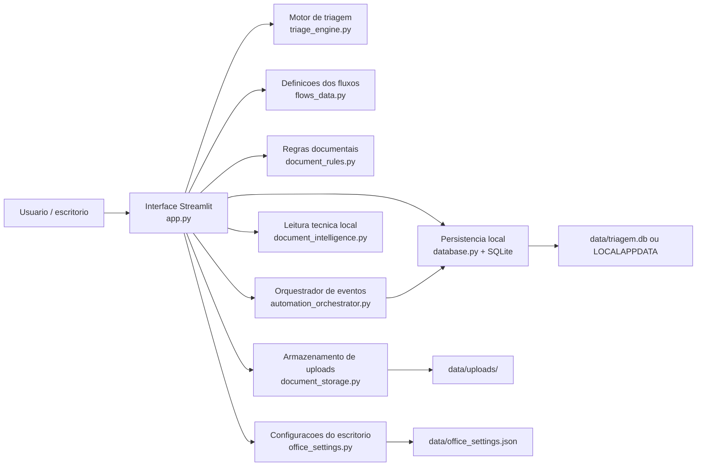

# Arquitetura do Sistema

## 1. Objetivo deste documento

Este documento e o balizador tecnico do `SOFI.IA PREVI`.

Ele tem quatro objetivos:

1. registrar a arquitetura real do sistema hoje
2. separar o que ja esta implementado do que ainda e visao de produto
3. orientar futuras refatoracoes sem perder a logica de negocio
4. servir como base para novas entregas de triagem, CRM, documentos e contratos

Este texto foi escrito a partir do codigo atual do repositorio, nao de uma arquitetura idealizada.

---

## 2. Visao geral

O `SOFI.IA PREVI` e uma aplicacao local-first, escrita em Python com Streamlit, focada em operacao previdenciaria.

Hoje o sistema entrega cinco capacidades centrais:

- onboarding visual e acesso local da operacao
- triagem guiada de leads por fluxos previdenciarios
- persistencia local de atendimentos em SQLite
- fase documental com checklist por beneficio, upload e leitura tecnica local
- camada operacional com dashboard, CRM, contratos e configuracoes do escritorio
- barramento interno de eventos com fila persistente, idempotencia, auditoria e tarefas automaticas

O sistema ainda nao e um SaaS multiusuario real. Ele hoje funciona como um produto local com experiencia visual de SaaS.

---

## 3. Posicionamento arquitetural atual

### 3.1 Natureza do produto

O projeto esta em uma fase intermediaria entre:

- `MVP operacional local`
- `plataforma SaaS previdenciaria em construcao`

Isso significa que a experiencia visual ja aponta para um produto comercial, mas varias camadas ainda sao locais, monoliticas ou simuladas.

### 3.2 O que e fato implementado

- interface principal em Streamlit
- 11 fluxos de triagem definidos em dados
- motor deterministico de navegacao entre perguntas
- banco SQLite para salvar atendimentos e documentos
- checklist documental por tipo de beneficio
- upload local de PDF e imagem
- leitura de PDF nativo com `pypdf` quando a dependencia esta instalada
- OCR local com `pytesseract` + executavel Tesseract quando disponivel
- preview de contrato padrao de honorarios
- calculadora de salario-maternidade
- credencial local protegida por hash com salt
- central de automacoes e bloqueio de tarefas juridicas ate revisao humana

### 3.3 O que hoje aparece mais como visao de produto do que como modulo pronto

- automacao real com WhatsApp
- assinatura digital integrada
- audio com voz clonada
- multiusuario real com identidade persistente
- API externa para operacao comercial

Esses pontos aparecem na narrativa de produto e no design, mas nao existem ainda como integracoes operacionais completas no codigo atual.

---

## 4. Visao macro da arquitetura



Leitura pratica:

- `app.py` e o orquestrador da aplicacao inteira
- os fluxos sao dirigidos por dados, nao por telas codificadas uma a uma
- a persistencia e local
- a fase documental reaproveita o atendimento aprovado para abrir um dossie tecnico

---

## 5. Stack tecnologica atual

### Backend e interface

- Python 3.x
- Streamlit

### Persistencia

- SQLite
- JSON local para configuracoes do escritorio

### Leitura documental

- `pypdf` para texto nativo em PDF
- `Pillow` para manipulacao basica de imagem
- `pytesseract` para OCR
- executavel `tesseract.exe` instalado no Windows

### Runtime local

- Windows
- arquivos `.bat` para inicializacao

### Dependencias declaradas

Arquivo: `requirements.txt`

- `streamlit==1.55.0`

Observacao importante:

as dependencias documentais aparecem hoje como opcionais em comentario no `requirements.txt`. Isso significa que o modulo documental existe no codigo, mas pode nao estar pronto no ambiente sem instalacao manual complementar.

---

## 6. Estrutura real do repositorio

## 6.1 Modulos ativos

| Caminho | Papel no sistema |
|---|---|
| `app.py` | Orquestrador principal da interface, sessao, CRM, triagem, contratos, documentos e configuracoes |
| `flows_data.py` | Fonte de verdade dos fluxos de triagem |
| `triage_engine.py` | Motor deterministico que avanca, volta e conclui a arvore de decisao |
| `database.py` | Persistencia local em SQLite e agregacoes de dashboard |
| `document_rules.py` | Checklist e estrategia documental por beneficio |
| `document_storage.py` | Gravacao local dos uploads anexados ao atendimento |
| `document_intelligence.py` | Extracao local de texto, OCR e leitura heuristica dos campos criticos |
| `office_settings.py` | Configuracoes do escritorio e percentuais de honorarios |
| `auth_security.py` | Validacao e armazenamento local de credenciais protegidas por PBKDF2 |
| `automation_orchestrator.py` | Recepcao idempotente, processamento e roteamento de eventos para tarefas do CRM |
| `runtime_paths.py` | Diretorio unico e configuravel para todos os dados operacionais |
| `iniciar_robo_inss.bat` | Inicializacao direta do Streamlit |
| `iniciar_robo_inss_completo.bat` | Inicializacao com verificacao de ambiente e abertura automatica do navegador |

## 6.2 Arquivos legados ou prototipos paralelos

| Caminho | Situacao |
|---|---|
| `index.html` | Prototipo web estatico, nao e a interface principal ativa |
| `app.js` | Prototipo legada de front-end estatico |
| `flows.js` | Versao antiga dos fluxos para o prototipo HTML/JS |
| `styles.css` | Estilo do prototipo HTML/JS |

Decisao arquitetural importante:

o produto ativo hoje e o Streamlit em `app.py`. Os arquivos HTML/JS/CSS devem ser tratados como legado, referencia visual ou material de transicao, nao como base operacional principal.

---

## 7. Modulos principais e responsabilidades

## 7.1 `app.py`

E o modulo central da aplicacao.

Responsabilidades:

- configurar a pagina Streamlit
- inicializar banco
- garantir valores default de sessao
- renderizar onboarding e login local
- renderizar shell principal do produto
- conduzir a triagem do lead
- salvar resultado
- abrir fase documental
- montar dashboard, CRM, contratos e configuracoes
- calcular estimativa de salario-maternidade

Ponto de atencao:

`app.py` esta concentrando interface, regras operacionais, estados de sessao e parte da logica de produto. E funcional, mas ja esta grande demais e e o principal candidato a modularizacao.

## 7.2 `flows_data.py`

E a camada declarativa do negocio de triagem.

Cada fluxo contem:

- `id`
- `name`
- `start`
- `nodes`
- `results`

Hoje existem 11 fluxos ativos:

1. Auxilio-Acidente
2. Aposentadoria
3. BPC/LOAS
4. Salario-Maternidade
5. Auxilio-Doenca
6. Aposentadoria por Invalidez
7. Pensao por Morte
8. Auxilio-Reclusao
9. Revisao de Beneficio
10. Planejamento Previdenciario
11. Outros Assuntos

Valor arquitetural:

isso permite evoluir perguntas e resultados sem reescrever a navegacao do motor.

## 7.3 `triage_engine.py`

Implementa o motor simples de arvore de decisao.

Responsabilidades:

- criar estado inicial
- localizar a pergunta atual
- registrar resposta no historico
- decidir proximo no ou resultado final
- permitir retorno para a pergunta anterior

Esse motor e deterministico. Nao usa IA para decidir rota. Isso e positivo para previsibilidade juridica e auditoria.

## 7.4 `database.py`

Responsavel por persistencia e consultas operacionais.

Responsabilidades:

- resolver pasta de dados
- criar e migrar estrutura minima do SQLite
- salvar atendimentos
- pesquisar atendimentos
- gerar metricas de dashboard
- semear checklist documental
- atualizar status de documentos

Ele faz tanto persistencia quanto agregacoes analiticas leves.

## 7.5 `document_rules.py`

E a base de regras da fase documental.

Responsabilidades:

- definir documentos comuns a todos os beneficios
- definir documentos especificos por fluxo
- definir foco tecnico da analise documental
- definir campos criticos por documento

Essa camada ja traduz bem o raciocinio juridico-operacional para dados estruturados.

## 7.6 `document_storage.py`

Responsavel por salvar os anexos do caso localmente.

Responsabilidades:

- sanitizar nome de arquivo
- criar pasta por atendimento
- persistir o binario recebido no upload

Padrao atual:

- `data/uploads/atendimento_<id>/`

## 7.7 `document_intelligence.py`

Responsavel pela leitura tecnica local.

Responsabilidades:

- identificar o tipo do arquivo
- extrair texto de PDF nativo
- executar OCR em imagem
- consolidar saida de multiplos arquivos
- estimar confianca da extracao
- extrair campos criticos por heuristica e regex

Ponto importante:

essa etapa nao usa LLM no estado atual. A extracao estruturada e baseada em regex, labels e heuristicas locais.

## 7.8 `office_settings.py`

Responsavel pelas configuracoes persistentes do escritorio.

Responsabilidades:

- carregar defaults
- salvar dados basicos do escritorio
- manter plano selecionado
- armazenar percentuais de honorarios
- resolver percentual conforme o beneficio

---

## 8. Modelo de dados atual

## 8.1 Tabela `atendimentos`

Representa o resultado da triagem do lead.

Campos principais:

- `id`
- `created_at`
- `lead_name`
- `lead_phone`
- `flow_id`
- `flow_name`
- `status`
- `result_title`
- `summary`
- `next_step`
- `notes`
- `history_json`
- `benefit_category`
- `estimated_monthly_value`
- `estimated_total_value`

Uso:

- armazenar historico da triagem
- alimentar dashboard e CRM
- servir como ancora para fase documental

## 8.2 Tabela `atendimento_documentos`

Representa o checklist documental vinculado a um atendimento.

Campos principais:

- `attendance_id`
- `flow_id`
- `document_code`
- `document_name`
- `category`
- `required`
- `status`
- `notes`
- `critical_fields_json`
- `uploaded_files_json`
- `raw_text`
- `extracted_data_json`
- `source_type`
- `extraction_status`
- `extraction_confidence`
- `technical_notes`

Uso:

- controlar pendencia documental
- guardar trilha de leitura tecnica
- registrar consistencia ou ilegibilidade

## 8.3 Arquivos locais complementares

| Caminho | Uso |
|---|---|
| `data/office_settings.json` | Configuracoes persistentes do escritorio |
| `data/uploads/` | Binarios de documentos anexados |
| `data/triagem.db` ou `%LOCALAPPDATA%\\Robo do INSS\\data\\triagem.db` | Banco SQLite |

---

## 9. Fluxo operacional principal

## 9.1 Bootstrap da aplicacao

Na subida do sistema:

1. `main()` chama `init_database()`
2. aplica CSS customizado
3. garante estado inicial de sessao
4. se nao houver autenticacao local na sessao, renderiza onboarding/login
5. se houver autenticacao local, abre o shell operacional

## 9.2 Fluxo de triagem

1. o operador informa nome, telefone e tipo de atendimento
2. o sistema carrega o fluxo correspondente em `flows_data.py`
3. `triage_engine.py` avanca a cada resposta
4. ao final, um `result` define:
   - status
   - resumo
   - proximo passo
5. o atendimento pode ser salvo no SQLite

## 9.3 Abertura automatica da fase documental

Quando um atendimento e salvo com status:

- `aprovado`
- `revisao`

o sistema faz seed do checklist documental com base em `document_rules.py`.

Essa e uma decisao arquitetural boa porque transforma a triagem em esteira operacional, nao em fim de processo.

## 9.4 Fluxo documental

1. o operador abre o atendimento na fase documental
2. o sistema mostra checklist do beneficio
3. o usuario envia PDF ou imagem
4. o arquivo e salvo por `document_storage.py`
5. o operador pode disparar `Executar leitura tecnica`
6. `document_intelligence.py` tenta:
   - leitura de PDF nativo
   - OCR em imagem
   - consolidacao do texto
   - extracao heuristica de campos
7. o resultado e gravado no banco
8. o score do dossie e recalculado

## 9.5 Fluxo de contrato

Para fluxos aprovados, o sistema consegue:

- montar minuta padrao de honorarios
- aplicar percentual do escritorio
- mostrar preview textual do contrato

Hoje isso e preview interno, nao assinatura integrada.

## 9.6 Fluxo especial de salario-maternidade

Quando o fluxo e `Salario-Maternidade`, existe uma calculadora especifica que:

- recebe categoria da segurada
- aplica regras parametrizadas de 2026
- estima valor mensal
- estima total em 120 dias
- salva categoria e valores no atendimento

---

## 10. Views e shell operacional

A interface principal esta organizada em views:

- `Dashboard`
- `CRM`
- `Leads`
- `Contratos`
- `Configuracoes`

### Dashboard

Concentra:

- metricas do pipeline
- cards de produto
- etapas da operacao
- resumo executivo

### CRM

Concentra:

- funil em estilo kanban
- agrupamento por etapa operacional
- visao rapida da carteira

### Leads

Concentra:

- triagem guiada
- fase documental
- consulta de atendimentos

### Contratos

Concentra:

- preview da minuta
- valores e elegibilidade relacionados ao caso

### Configuracoes

Concentra:

- dados do escritorio
- percentuais de honorarios
- plano selecionado
- video/tutorial institucional

---

## 11. Principios arquiteturais que ja aparecem no codigo

Mesmo sem um documento formal anterior, o codigo ja revela alguns principios fortes:

## 11.1 Flow-driven architecture

O coracao da triagem esta nos dados do fluxo, nao em ifs espalhados por tela.

## 11.2 Local-first

Persistencia, configuracao e uploads estao pensados para rodar localmente e continuar funcionando sem nuvem obrigatoria.

## 11.3 Fail-soft

O modulo documental nao quebra o sistema se faltar dependencia. Ele devolve status como:

- `dependencia_ausente`
- `sem_texto`
- `erro`

## 11.4 Determinismo no filtro juridico

O motor de triagem nao terceiriza a decisao da rota para IA generativa.

## 11.5 Dossie como extensao da triagem

A fase documental nasce do resultado da triagem e nao como modulo isolado.

---

## 12. Riscos e limitacoes atuais

## 12.1 Monolito de interface em `app.py`

Hoje `app.py` concentra UI, navegacao, calculo, sessao e parte da logica operacional.

Risco:

- aumento de custo de manutencao
- maior chance de regressao visual e funcional
- dificuldade para testes automatizados

## 12.2 Diretorio operacional unificado

`database.py`, `office_settings.py`, `document_storage.py` e `auth_security.py` usam o diretorio resolvido por `runtime_paths.py`.

Por padrao, o Windows utiliza `%LOCALAPPDATA%\\Robo do INSS\\data`. Testes podem definir `ROBO_INSS_DATA_DIR` para isolar totalmente os dados.

## 12.3 Autenticacao local

O login possui uma conta local persistida com PBKDF2-HMAC-SHA256, salt aleatorio e comparacao em tempo constante.

Ainda nao ha multiusuario, identidade remota, recuperacao de senha ou permissao por perfil. A autenticacao atual e adequada ao MVP local, nao a um SaaS exposto na internet.

## 12.4 OCR depende de ambiente

O pipeline de OCR depende de:

- `pytesseract`
- executavel do Tesseract
- eventualmente `pypdf` e `Pillow`

Se o ambiente nao estiver completo, a aplicacao continua funcionando, mas com leitura documental reduzida.

## 12.5 Claims de produto adiantados em relacao ao backend

A camada de marketing visual fala de:

- WhatsApp
- assinatura digital
- audio
- follow-up automatizado

Mas o repositorio atual ainda nao implementa essas integracoes ponta a ponta.

Arquiteturalmente isso pede separacao clara entre:

- `modulos implementados`
- `roadmap comercial`

## 12.6 Presenca de front-end legado paralelo

Os arquivos `index.html`, `app.js`, `flows.js` e `styles.css` podem confundir manutencao, onboarding e futuras decisoes.

---

## 13. Arquitetura alvo recomendada

Sem romper a base atual, a evolucao mais saudavel e esta:

```text
app/
  ui/
    auth.py
    dashboard.py
    crm.py
    leads.py
    contracts.py
    settings.py
  services/
    triage_service.py
    document_service.py
    contract_service.py
    metrics_service.py
  repositories/
    attendance_repository.py
    document_repository.py
    settings_repository.py
  domain/
    flows.py
    document_policies.py
    scoring.py
  infra/
    sqlite.py
    storage.py
    ocr.py
    pdf.py
main.py
```

### Objetivo dessa divisao

- tirar regras de negocio de dentro da camada visual
- tornar o projeto testavel por modulo
- permitir evolucao para API no futuro
- reduzir acoplamento entre Streamlit e dominio

---

## 14. Evolucao recomendada por fases

## Fase 1 - Consolidacao estrutural

- quebrar `app.py` em modulos por view e por servico
- unificar o diretorio de dados
- mover regras de contrato e score para servicos dedicados
- tornar o login explicitamente "demo local" ou implementar autenticacao real

## Fase 2 - Robustez operacional

- incluir todas as dependencias documentais no `requirements.txt`
- criar validacao automatica de ambiente
- adicionar logs tecnicos estruturados
- padronizar mensagens de erro e fallback documental

## Fase 3 - SaaS de verdade

- usuarios persistidos
- workspaces por escritorio
- permissao por perfil
- fila assicrona para OCR e processamentos pesados
- integracoes externas reais

## Fase 4 - Inteligencia previdenciaria avancada

- leitura documental com modelos mais fortes
- classificacao de tese revisional
- orquestracao de follow-up
- integracao com assinatura e canais de entrada

---

## 15. Decisoes tecnicas balizadoras para as proximas tarefas

Estas decisoes devem orientar novas implementacoes:

1. `flows_data.py` deve continuar como fonte central dos fluxos.
2. `triage_engine.py` deve permanecer deterministico para elegibilidade inicial.
3. Toda evolucao documental deve respeitar a estrutura de checklist em `document_rules.py`.
4. Novas persistencias devem convergir para um diretorio unico de dados.
5. Integracoes comerciais futuras devem entrar como adaptadores, nao como logica espalhada na UI.
6. O front-end legado HTML/JS nao deve voltar a ser a base principal sem decisao explicita.
7. A camada de marketing visual deve ser mantida coerente com o estado real do backend.

---

## 16. Orquestracao interna de eventos

A primeira camada de integracao foi implementada sem dependencia do Astrea.

### Eventos suportados

- `lead.qualified`
- `whatsapp.lead.qualified`
- `process.movement.received`
- `publication.received`
- `inss.requirement.detected`

### Persistencia

- `integration_events`: fila, payload, origem, chave idempotente, tentativas e falhas
- `integration_audit_log`: trilha cronologica de recepcao, tarefa, falha e revisao
- `crm_tarefas.source_event_id`: vinculo unico que impede tarefas duplicadas

### Garantias de negocio

1. Eventos repetidos retornam o registro existente.
2. Uma origem externa nao escreve diretamente nas telas ou nas tabelas de dominio.
3. Publicacoes, movimentacoes e exigencias criam somente prioridade e data operacional sugerida.
4. Tarefas juridicas criticas nao podem ser concluidas antes da revisao humana.
5. Aprovacao e rejeicao entram na trilha de auditoria.
6. Astrea nao integra nem faz parte da arquitetura alvo.
7. Senhas GOV.BR e cookies de clientes nao devem ser armazenados pelo produto.

Conectores futuros devem chamar `receive_event` e nunca contornar o orquestrador.

---

## 17. Resumo executivo

O `SOFI.IA PREVI` ja tem uma espinha dorsal forte:

- fluxos dirigidos por dados
- triagem deterministica
- persistencia local
- checklist documental por beneficio
- leitura tecnica local com fallback
- shell operacional com cara de produto

O principal desafio agora nao e inventar mais tela, e sim consolidar a arquitetura.

Se a proxima fase for bem conduzida, o sistema pode sair de:

- `produto visualmente promissor com nucleo local forte`

para:

- `plataforma previdenciaria operacional, modular e pronta para integracoes reais`

Essa arquitetura deve ser usada como referencia principal para as proximas mudancas do repositorio.
